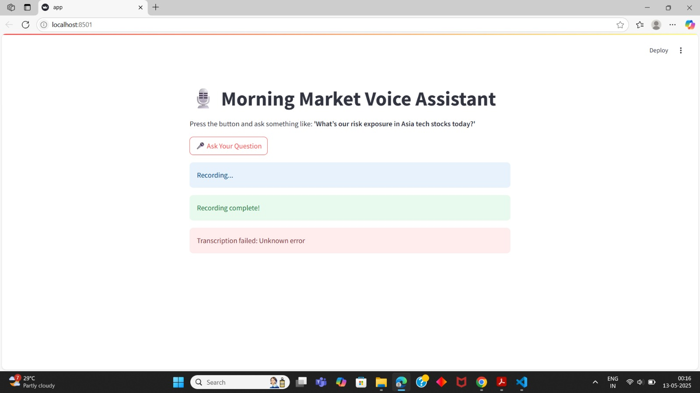

# Multi-Agent Financial Assistant

## Overview

This is a multi-agent financial assistant application that leverages various agents (retriever, analysis, API, scraping, and voice agents) to deliver market insights and data analysis. The frontend is built with Streamlit, and the backend utilizes FastAPI microservices. The entire system is containerized using Docker for easy deployment.

## Current Status

**Backend Error (Transcript Issue):**  
There is currently an issue with the transcript feature in the backend. I have been trying to fix it, but unfortunately, it has not been resolved yet. The problem seems to be related to [briefly describe the issue, e.g., "the voice-to-text integration" or "incorrect transcript output"]. 

As a result, some features, particularly those involving voice interaction and transcription, may not work as expected.

## Image

<p align="center">
  <a href="https://www.youtube.com/watch?v=7D33ejPL3Bw">
    
  </a>
</p>


## How to Run

1. Clone this repository:
   ```bash
   git clone <repository-url>
